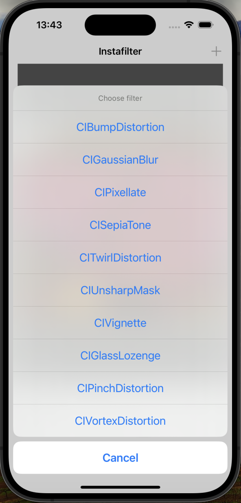
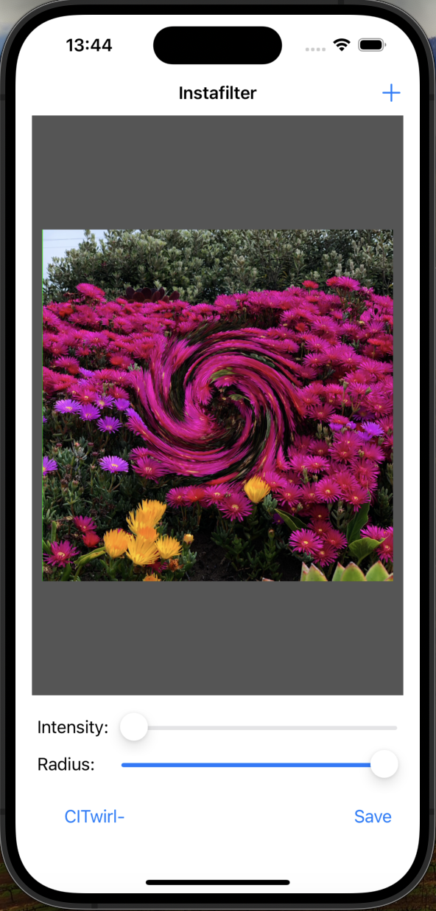

# Project 13: InstaFilter

Instafilter is a mobile app that allows users to apply various filters to their images using Core Image filters. The app provides a simple and intuitive interface for users to import images, select filters, and adjust filter settings.

## Table of Contents

- [Features](#features)
- [Screenshots](#screenshots)
- [Requirements](#requirements)
- [Usage](#usage)
- [Code Overview](#code-overview)
- [Possible Improvements](#possible-improvements)

## Features

- Apply various filters to images using Core Image filters.
- Import images from the camera roll or take a new photo.
- Adjust filter intensity and radius.
- Save processed images to the camera roll.

## Screenshots

  
   
  <em>Filter Selection Screen</em>

  
   
  <em>Processed Image Screen</em>

## Requirements

- iOS 12.0+
- Xcode 12.0+
- Swift 5.0+

## Usage

1. Launch the app.
2. Import an image from the camera roll or take a new photo.
3. Select a filter from the list.
4. Adjust the filter intensity and radius using the sliders.
5. Tap the "Save" button to save the processed image to the camera roll.

## Code Overview

### View

- **Main.storyboard**: The storyboard file defining the user interface, including image views, sliders, and buttons.

### Controller

- **ViewController.swift**: Manages the game flow and user interactions. Handles image importing, filter selection, and processing.

The controller class uses Core Image filters to apply effects to images, and provides a simple and intuitive interface for users to interact with the app.

## Possible Improvements

- Add more filter options.
- Implement animations for filter transitions.
- Add support for video processing.
- Improve performance by optimizing filter rendering.
- Add a share button to share processed images on social media platforms.
